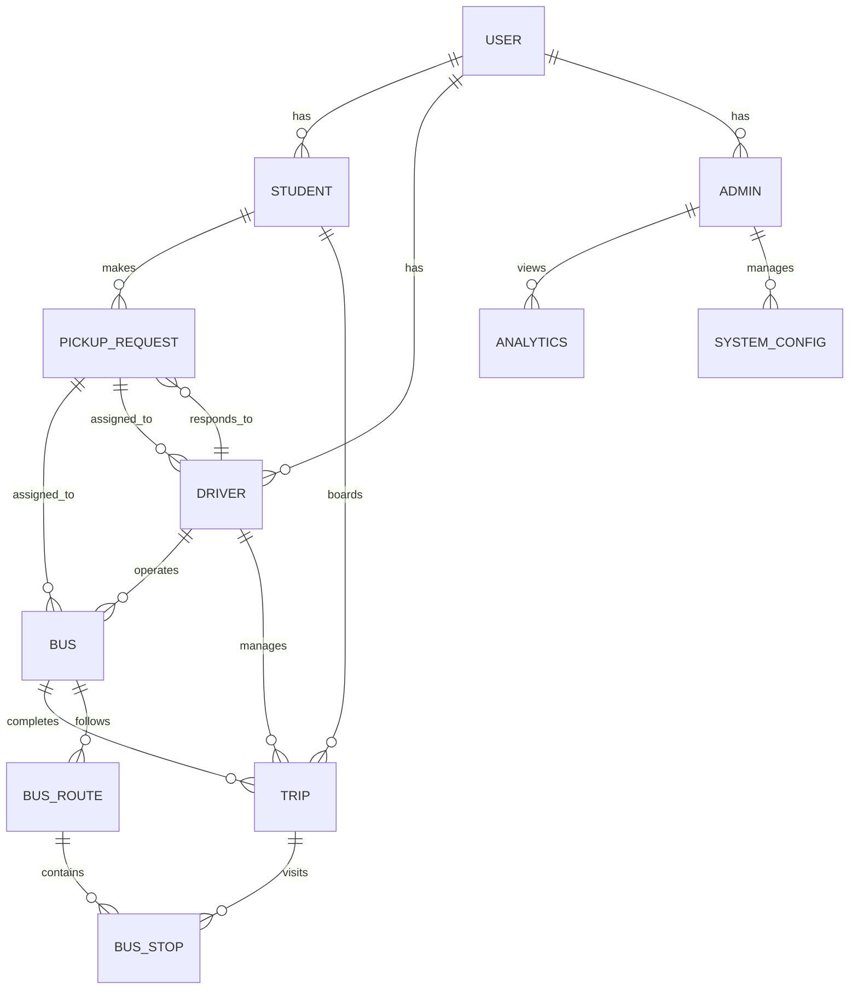

# Database Schema & ER Diagrams

## Entity Relationship Diagram (ER)



---

## Detailed Schema

### USER Collection
```json
{
  "id": "user_uuid",
  "email": "user@university.edu",
  "name": "Full Name",
  "userType": "student|driver|admin",
  "isActive": true,
  "isVerified": false,
  "createdAt": "2024-01-15T10:30:00Z",
  "lastLogin": "2024-01-20T14:45:00Z",
  "lastUpdated": "2024-01-20T14:45:00Z"
}
```

**Indices:**
- Primary: `id`
- Secondary: `email`
- Composite: `userType`, `isActive`

### STUDENT Collection
```json
{
  "id": "std_uuid",
  "userId": "user_uuid",
  "registrationNumber": "REG123456",
  "name": "Student Name",
  "email": "student@university.edu",
  "phone": "+91-9876543210",
  "department": "Computer Science",
  "batch": "2024",
  "homeLocation": {
    "latitude": 13.0059,
    "longitude": 77.5761,
    "address": "Hostel A, Block 3",
    "label": "Hostel"
  },
  "emergencyContact": {
    "name": "Parent Name",
    "phone": "+91-8765432109"
  },
  "isLocationSharing": false,
  "totalTrips": 45,
  "averageRating": 4.5,
  "createdAt": "2024-01-15T10:30:00Z",
  "lastUpdated": "2024-01-20T14:45:00Z"
}
```

**Indices:**
- Primary: `id`
- Secondary: `userId`
- Composite: `department`, `batch`

### DRIVER Collection
```json
{
  "id": "drv_uuid",
  "userId": "user_uuid",
  "licenseNumber": "DL-0120230001234",
  "licenseExpiry": "2026-01-15",
  "name": "Driver Name",
  "email": "driver@transport.edu",
  "phone": "+91-8765432109",
  "status": "available|on_duty|offline|on_leave",
  "totalTrips": 456,
  "totalHours": 2340,
  "averageRating": 4.7,
  "documentVerified": true,
  "backgroundCheckStatus": "cleared",
  "createdAt": "2024-01-10T08:00:00Z",
  "lastUpdated": "2024-01-20T10:00:00Z"
}
```

### BUS Collection
```json
{
  "id": "bus_uuid",
  "registrationNumber": "KA-01-AB-1234",
  "busName": "Bus 001",
  "routeName": "Main Campus Route",
  "driverId": "drv_uuid",
  "currentStopId": "stop_1",
  "capacity": 40,
  "currentOccupancy": 25,
  "status": "available|in_transit|maintenance|inactive",
  "currentLatitude": 13.0059,
  "currentLongitude": 77.5761,
  "lastLocationUpdate": "2024-01-20T15:05:23Z",
  "features": {
    "ac": true,
    "gps": true,
    "wifi": false,
    "usb_chargers": true
  },
  "maintenance": {
    "lastService": "2024-01-10",
    "nextService": "2024-02-10",
    "status": "active"
  },
  "createdAt": "2024-01-01T00:00:00Z",
  "lastUpdated": "2024-01-20T15:05:23Z"
}
```

**Indices:**
- Primary: `id`
- Secondary: `driverId`
- Composite: `status`, `routeName`

### BUS_STOP Collection
```json
{
  "id": "stop_uuid",
  "name": "Main Gate",
  "latitude": 13.0059,
  "longitude": 77.5761,
  "address": "Main Entrance, Campus",
  "description": "Main entry point of the campus",
  "type": "terminal|intermediate|hostel|academic",
  "isActive": true,
  "averageWaitTime": 8,
  "dailyPassengers": 450,
  "createdAt": "2024-01-01T00:00:00Z",
  "lastUpdated": "2024-01-20T10:00:00Z"
}
```

**Indices:**
- Primary: `id`
- Secondary: `type`

### BUS_ROUTE Collection
```json
{
  "id": "route_uuid",
  "routeName": "Main Campus Route",
  "description": "Route covering all major stops",
  "stopsSequence": [
    {
      "stopId": "stop_1",
      "sequence": 1,
      "waitTime": 5,
      "distance": 0
    },
    {
      "stopId": "stop_2",
      "sequence": 2,
      "waitTime": 8,
      "distance": 2.5
    }
  ],
  "totalDistance": 25.3,
  "estimatedDuration": 120,
  "frequency": "30 minutes",
  "operatingHours": {
    "startTime": "06:00",
    "endTime": "22:00"
  },
  "isActive": true,
  "createdAt": "2024-01-05T00:00:00Z"
}
```

### PICKUP_REQUEST Collection
```json
{
  "id": "req_uuid",
  "studentId": "std_uuid",
  "studentName": "Student Name",
  "studentPhone": "+91-9876543210",
  "pickupLatitude": 13.0059,
  "pickupLongitude": 77.5761,
  "destinationStopId": "stop_library",
  "requestTime": "2024-01-20T15:00:00Z",
  "expiresAt": "2024-01-20T15:15:00Z",
  "status": "pending|accepted|completed|cancelled|expired",
  "assignedBusId": "bus_001",
  "assignedDriverId": "drv_123",
  "estimatedArrivalMinutes": 8,
  "actualArrivalMinutes": null,
  "completedTime": null,
  "cancelledReason": null,
  "priority": "critical|high|medium|low",
  "desiredArrivalTime": null,
  "rating": null,
  "feedback": null
}
```

**Indices:**
- Primary: `id`
- Secondary: `studentId`
- Composite: `status`, `requestTime`
- Geospatial: `pickupLatitude`, `pickupLongitude`

### TRIP Collection
```json
{
  "id": "trip_uuid",
  "busId": "bus_uuid",
  "driverId": "drv_uuid",
  "routeName": "Main Campus Route",
  "startTime": "2024-01-20T07:00:00Z",
  "endTime": "2024-01-20T17:00:00Z",
  "stopsSequence": ["stop_1", "stop_2", "stop_3"],
  "stopArrivalTimes": {
    "stop_1": "2024-01-20T07:15:00Z",
    "stop_2": "2024-01-20T07:45:00Z",
    "stop_3": "2024-01-20T08:15:00Z"
  },
  "studentsBoarded": ["std_1", "std_2", "std_3"],
  "totalDistance": 25.3,
  "totalTime": 600,
  "averageSpeed": 25.3,
  "fuelConsumed": 8.5,
  "status": "scheduled|in_progress|completed|cancelled",
  "incidents": [],
  "notes": "",
  "createdAt": "2024-01-20T06:30:00Z"
}
```

### LIVE_LOCATION Collection (Realtime DB)
```json
{
  "entityId": "bus_001",
  "entityType": "bus|student|driver",
  "latitude": 13.0050,
  "longitude": 77.5770,
  "timestamp": "2024-01-20T15:05:23Z",
  "speed": 25.5,
  "heading": 45.0,
  "accuracy": 10,
  "isActive": true,
  "stopId": "stop_main_gate"
}
```

### ANALYTICS Collection
```json
{
  "id": "analytics_uuid",
  "eventType": "pickup_request|bus_arrival|student_boarded|trip_completed",
  "timestamp": "2024-01-20T15:00:00Z",
  "busId": "bus_uuid",
  "studentId": "std_uuid",
  "driverId": "drv_uuid",
  "data": {
    "waitTime": 8,
    "distance": 2.5,
    "eta_accuracy": 0.95,
    "occupancy": 0.65
  },
  "metadata": {
    "appVersion": "1.0.0",
    "platform": "android|ios|web",
    "userType": "student|driver|admin"
  }
}
```

**Indices:**
- Primary: `id`
- Composite: `eventType`, `timestamp`

### SYSTEM_CONFIG Collection
```json
{
  "id": "config",
  "pickupRequestTimeout": 900,
  "locationSharingTimeout": 900,
  "maxPickupDistance": 2.0,
  "priorityWeights": {
    "priority": 0.3,
    "waitTime": 0.3,
    "distance": 0.2,
    "desiredTime": 0.2
  },
  "gpsUpdateInterval": 30,
  "notificationSettings": {
    "enablePickupNotifications": true,
    "enableArrivalNotifications": true
  },
  "lastUpdated": "2024-01-15T10:00:00Z"
}
```

---

## Data Relationships

### Student ←→ Pickup Request
- One student can have multiple pending requests
- Latest request takes priority
- Historical requests stored separately

### Driver ←→ Bus
- One driver operates one bus per trip
- Multiple drivers can operate same bus at different times

### Bus ←→ Trip
- One bus completes multiple trips per day
- One trip has one bus assignment

### BusRoute ←→ BusStop
- One route contains multiple stops (ordered)
- One stop can be in multiple routes

---

## Data Constraints

### Pickup Request
- `requestTime` ≤ current time
- `pickupLatitude` in [-90, 90]
- `pickupLongitude` in [-180, 180]
- `estimatedArrivalMinutes` > 0

### Bus
- `currentOccupancy` ≤ `capacity`
- `capacity` > 0

### Driver
- `licenseExpiry` > current date

### Analytics
- `eventType` in predefined list
- `timestamp` ≤ current time

---

## Query Patterns

### Find pending requests
```
Collection: pickup_requests
Where: status == "pending"
OrderBy: requestTime (ascending)
Limit: 50
```

### Find active buses
```
Collection: buses
Where: status in ["available", "in_transit"]
OrderBy: lastLocationUpdate (descending)
```

### Find trips for date range
```
Collection: trips
Where: startTime >= date_start AND startTime <= date_end
OrderBy: startTime (descending)
```

### Find nearest students
```
Geospatial Query:
Collection: live_locations
Where: entityType == "student"
GeoQuery: center point, radius
Limit: 10
```

---

**Last Updated**: January 2024
