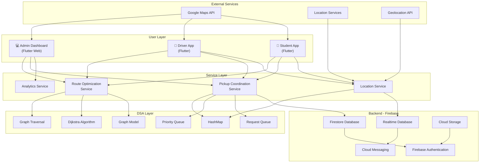
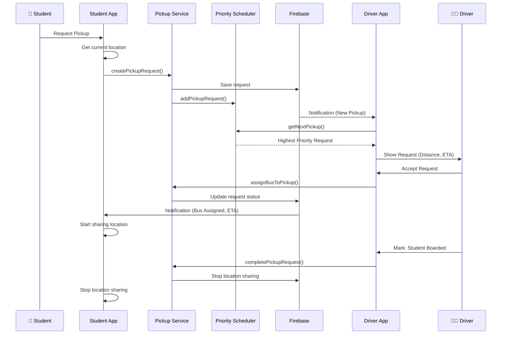
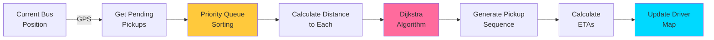
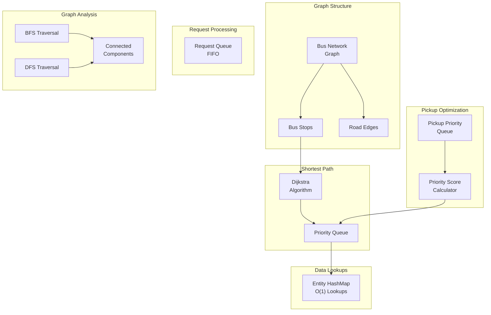
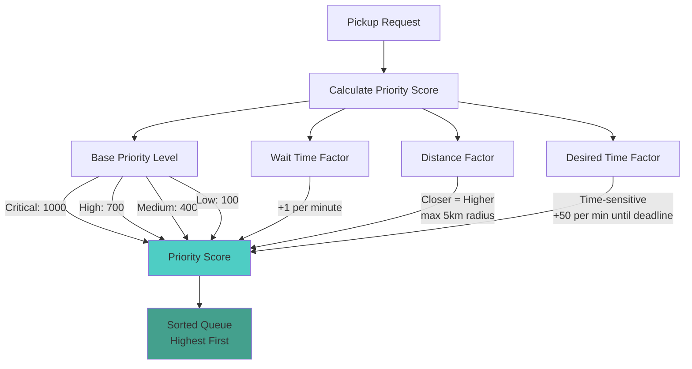
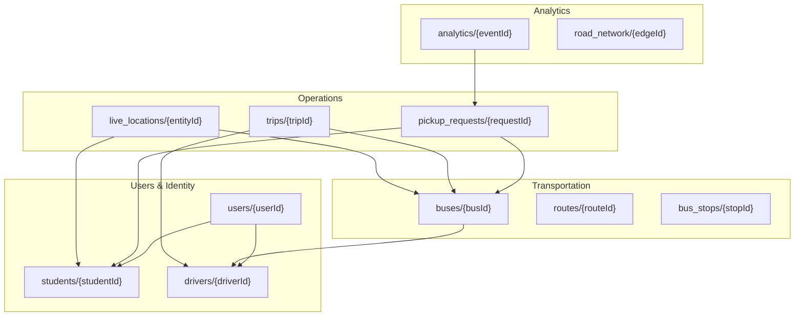
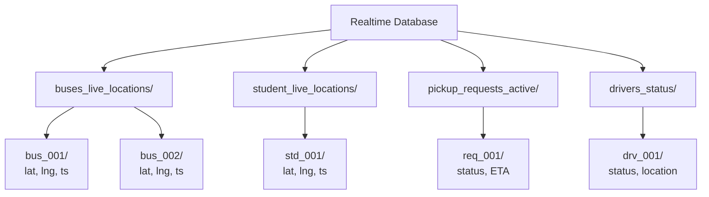
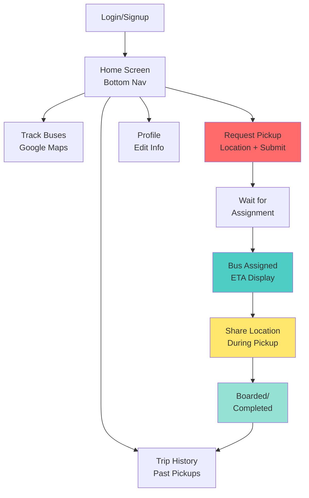
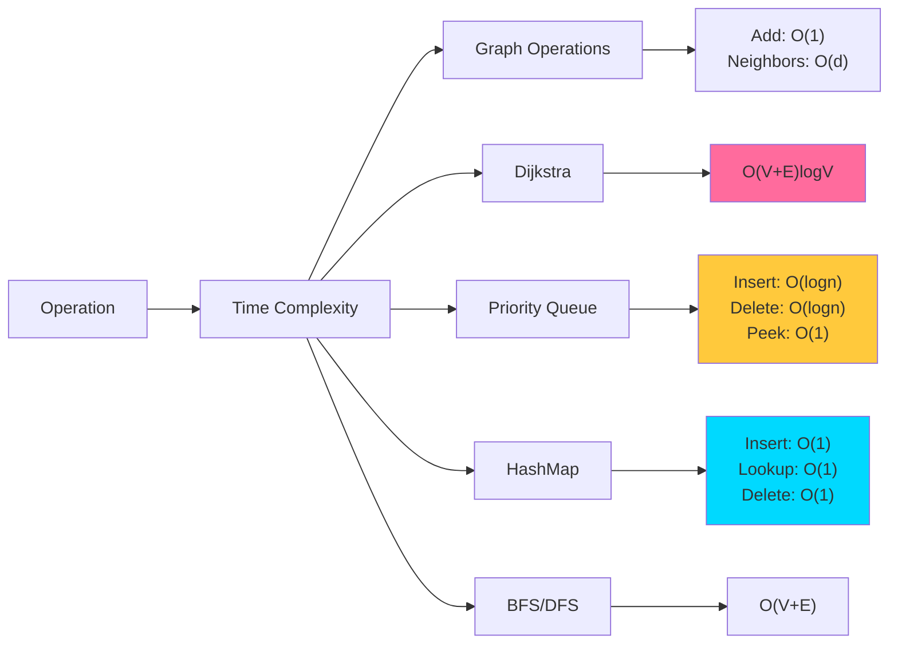
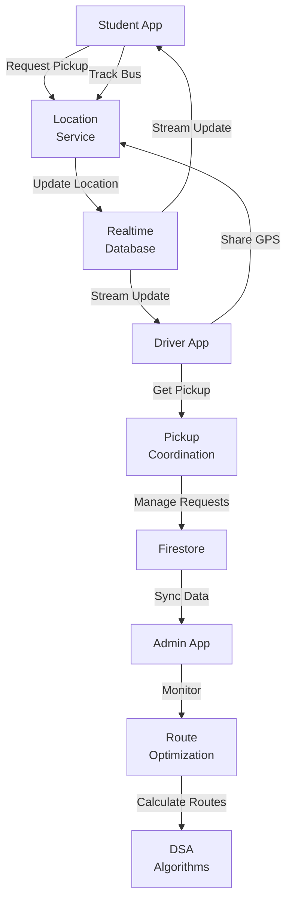

# System Architecture Diagrams

## 1. Overall System Architecture

---

## 2. Data Flow - Pickup Request

---

## 3. Route Optimization Flow

---

## 4. Algorithm Architecture

---

## 5. Priority Queue Scoring

---

## 6. Firebase Collections Schema

---

## 7. Realtime Database Structure

---

## 8. Student App Screens Flow

---

## 9. DSA Time Complexity

---

## 10. System Components Interaction

---

**Last Updated**: January 2024
